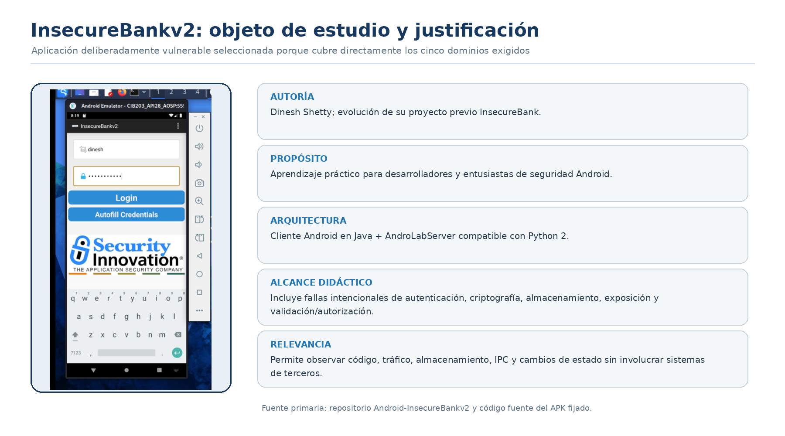
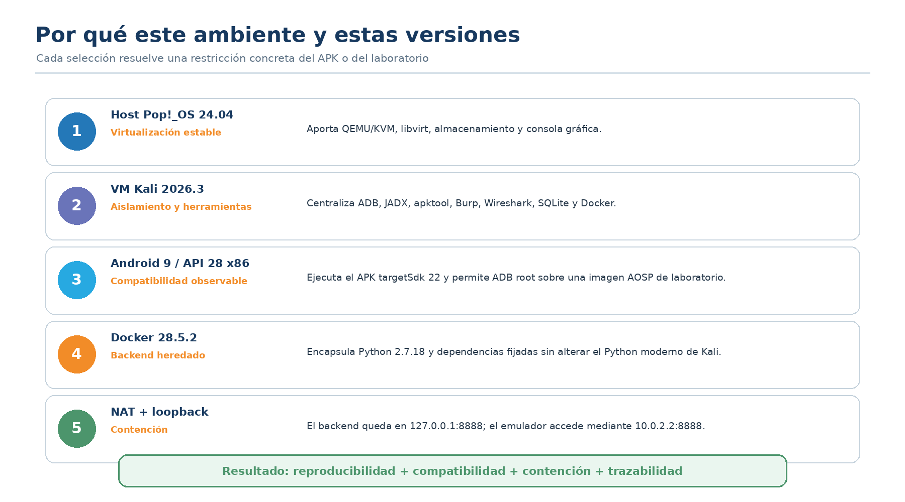
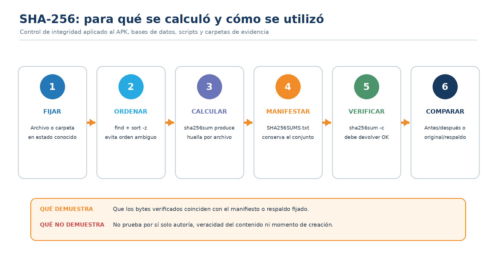

# Laboratorio: auditoría de seguridad en aplicaciones móviles

[English](README.en.md) · [BOM](docs/BOM.es.md) · [Metodología](docs/METODOLOGIA.es.md)

**Autor:** [Eduardo J. Vega Arguedas (Ed)](https://www.linkedin.com/in/eduardovegaa/)

Tutorial reproducible para construir un laboratorio aislado de Android y estudiar **InsecureBankv2**, una aplicación deliberadamente vulnerable creada por Dinesh Shetty con fines educativos.

> Uso exclusivo en un ambiente autorizado. No exponga el backend vulnerable a Internet ni reutilice estas pruebas contra terceros.



## Qué se construye

```text
Equipo físico Linux
└── KVM/QEMU + libvirt
    └── Máquina virtual Kali Linux
        ├── Android Studio + SDK + ADB
        │   └── Android Emulator: Android 9 / API 28 / x86
        │       └── Cliente InsecureBankv2
        ├── Docker Engine
        │   └── AndroLabServer: Python 2.7.18, puerto 127.0.0.1:8888
        └── Herramientas: JADX, apktool, Wireshark/TShark, SQLite y curl
```

El emulador accede al loopback de Kali mediante `10.0.2.2:8888`. `10.0.2.2` es la dirección especial del emulador Android para alcanzar el host del dispositivo virtual; no representa la dirección personal del autor.


> **Nota gerencial — La arquitectura también es un control.** El aislamiento reduce exposiciones accidentales, permite volver a un estado conocido y hace que los resultados sean defendibles ante gobierno, auditoría o revisión de incidentes.

## Razón de cada capa

| Capa | Función | Razón de selección |
|---|---|---|
| Linux + KVM/QEMU | Alojar la VM | Permite snapshots y aislamiento del equipo de trabajo. |
| Kali Linux | Estación de análisis | Concentra herramientas de análisis Android, red y evidencia. |
| Android 9 / API 28 / x86 | Ejecutar el cliente | Mantiene compatibilidad con el APK heredado y permite inspección mediante ADB. |
| Docker | Ejecutar AndroLabServer | Encapsula Python 2 y dependencias obsoletas; evita instalarlas directamente en Kali. |
| Loopback + NAT | Contener la red | El backend queda publicado solo en `127.0.0.1:8888`. |



## Requisitos mínimos

- Procesador con virtualización asistida y `/dev/kvm` disponible.
- 16 GB de RAM recomendados para host, VM y emulador.
- 80 GB de almacenamiento libre recomendado.
- Distribución Linux con KVM/QEMU y libvirt.
- Kali Linux en la VM.
- Docker Engine dentro de Kali.
- Android Studio, Android SDK Platform 28 y una imagen AOSP x86 API 28.
- `adb`, `apktool`, `jadx`, `curl`, `git`, `sqlite3`, `tshark` y `wireshark`.

Las versiones validadas se encuentran en [BOM.es.md](docs/BOM.es.md).

## Preparación paso a paso

### 1. Crear la VM

1. Cree una VM Kali con red NAT, no puente directo.
2. Asigne al menos 4 vCPU, 8 GB de RAM y 60 GB de disco.
3. Confirme que KVM anidado esté disponible para ejecutar el emulador dentro de la VM.
4. Cree un snapshot limpio antes de instalar el laboratorio.

> **Nota gerencial — El tiempo de recuperación importa.** Un snapshot limpio define un objetivo práctico de recuperación. Un control que no puede restaurarse y verificarse está incompleto.

### 2. Instalar herramientas en Kali

Revise primero el script y luego aplíquelo:

```bash
./scripts/01_preparar_kali.sh
./scripts/01_preparar_kali.sh --apply
```

### 3. Obtener las fuentes oficiales

```bash
mkdir -p "$HOME/CIB203"
git clone https://github.com/dineshshetty/Android-InsecureBankv2.git \
  "$HOME/CIB203/Android-InsecureBankv2"
```

Fije el commit utilizado y regístrelo en su evidencia. Este repositorio no redistribuye el APK ni el código del proyecto de terceros.

> **Nota gerencial — La identidad del activo precede la aceptación del riesgo.** Una decisión sobre vulnerabilidades aplicada a un build no verificado puede ser técnicamente correcta y operacionalmente inútil.

### 4. Instalar Android Studio y crear el AVD

1. Instale Android Studio dentro de Kali.
2. Instale Android SDK Platform 28 y las Platform Tools.
3. Cree un AVD AOSP x86 con Android 9/API 28.
4. Inicie el emulador y valide:

```bash
adb devices -l
adb shell getprop ro.build.version.release
adb shell getprop ro.build.version.sdk
adb shell getprop ro.product.cpu.abi
```

La salida esperada debe identificar Android `9`, API `28` y ABI `x86`.

### 5. Preparar el backend contenido

```bash
export CIB203_REPO="$HOME/CIB203/Android-InsecureBankv2"
./scripts/02_preparar_backend.sh
./scripts/02_preparar_backend.sh --apply
```

El contenedor publica `8888` únicamente en `127.0.0.1`. No cambie el enlace a `0.0.0.0` en un laboratorio compartido.

> **Nota gerencial — Un contenedor no elimina el riesgo legado.** Docker hace reproducible y contenible el árbol de Python 2; no lo convierte en una tecnología soportada. La lectura correcta es «deuda técnica controlada», no «deuda remediada».

### 6. Configurar las credenciales ficticias localmente

```bash
cp .env.example .env
chmod 600 .env
```

Edite `.env` con las credenciales públicas de la versión de InsecureBankv2 que esté utilizando. `.env` está excluido del repositorio.

### 7. Iniciar y verificar

```bash
./scripts/03_iniciar_laboratorio.sh
set -a; source .env; set +a
./scripts/04_verificar_laboratorio.sh
```

En la aplicación configure servidor `10.0.2.2` y puerto `8888`.

## Flujo de auditoría

1. Fijar APK, commit, configuración y versiones.
2. Tomar una línea base.
3. Revisar código y manifiesto.
4. Ejecutar una prueba controlada con datos ficticios.
5. Comparar el estado anterior y posterior.
6. Restaurar toda mutación desde un respaldo verificado.
7. Sellar cada directorio con SHA-256.
8. Documentar resultado, límite y conclusión sin afirmar más de lo observado.

Los dominios cubiertos fueron autenticación, criptografía, almacenamiento, exposición y validación de entradas/autorización. El resumen metodológico está en [METODOLOGIA.es.md](docs/METODOLOGIA.es.md).

> **Nota gerencial — Los resultados negativos también tienen valor.** Un «no demostrado» correctamente delimitado evita invertir presupuesto en una afirmación no probada y señala dónde todavía se necesita más aseguramiento.

## Integridad de la evidencia

```bash
./scripts/06_sellar_evidencias.sh ./evidencias/E-01
```

SHA-256 sirve para comprobar igualdad o cambio de contenido respecto de un valor registrado. No demuestra por sí mismo quién produjo un archivo ni que su interpretación sea correcta.



## Material no publicado

No se incluyen bases de datos, PCAP, respaldos Android, credenciales, capturas crudas, rutas personales ni el informe académico con datos de otras personas. Esta exclusión es intencional y forma parte del control de privacidad.

## Autoría y fuentes

Laboratorio, automatización y tutorial: **Eduardo J. Vega Arguedas (Ed)**.

- Dinesh Shetty. [Android-InsecureBankv2](https://github.com/dineshshetty/Android-InsecureBankv2).
- OWASP Foundation. [Mobile Application Security](https://mas.owasp.org/).
- Android Developers. [Android Studio y SDK](https://developer.android.com/studio).

## Reutilización

El tutorial y los scripts originales se publican bajo [The Unlicense](../../../LICENSE). Puede usarlos, traducirlos, adaptarlos o enseñarlos. La atribución se agradece, pero no es obligatoria.

Si esto le sirve a alguien para construir una mejor práctica de seguridad, con eso basta. **¡Pura vida!**
