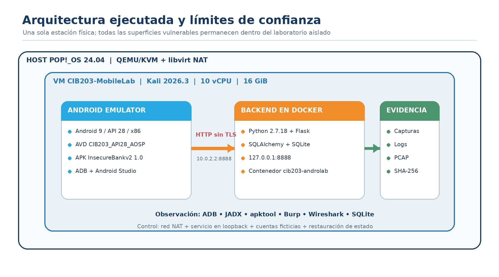

# Android Application Security Audit Lab

[Read in English](README.en.md) · [Leer en español](README.es.md)

> **Purpose | Propósito:** demonstrate how a controlled mobile-security assessment becomes defensible technical evidence and an actionable leadership conversation.
>
> **Portfolio area | Área del portafolio:** [Security Operations](../../../security-operations/README.md) · [Catalog](../../../CATALOG.md)
>
> **Boundary | Límite:** authorized, isolated, reproducible, and sanitized laboratory use only.

## Management editions | Ediciones gerenciales

- English: [Executive summary](docs/EXECUTIVE_SUMMARY.en.md) · [Management walkthrough](docs/MANAGEMENT_WALKTHROUGH.en.md)
- Español: [Resumen ejecutivo](docs/RESUMEN_EJECUTIVO.es.md) · [Walkthrough gerencial](docs/WALKTHROUGH_GERENCIAL.es.md)

## Transparency and licensing | Transparencia y licencias

- English: [AI use and transparency](docs/AI_USE_AND_TRANSPARENCY.en.md) · [Open-source notices](docs/OPEN_SOURCE_NOTICES.en.md)
- Español: [Uso de inteligencia artificial y transparencia](docs/USO_IA_Y_TRANSPARENCIA.es.md) · [Avisos de código abierto](docs/AVISOS_CODIGO_ABIERTO.es.md)

**Author | Autor:** Eduardo J. Vega Arguedas (Ed) · [LinkedIn](https://www.linkedin.com/in/eduardovegaa/) · [GitHub](https://github.com/edovega/) · [Program](https://ucenfotec.ac.cr/Carreras/maestria-profesional-en-ciberseguridad-y-seguridad-de-la-informacion/)

This is a public tutorial, not an academic submission. It combines a reproducible technical path with management notes for cybersecurity leaders.

Este es un tutorial público, no una entrega académica. Combina un recorrido técnico reproducible con notas gerenciales para líderes de ciberseguridad.

